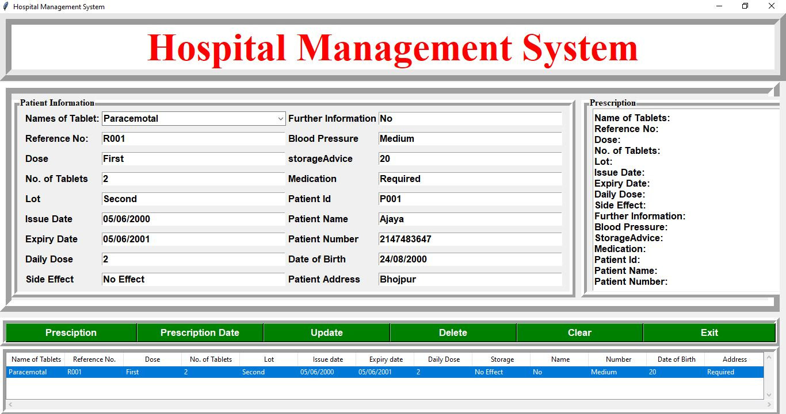

<h3>Hospital Management System</h3>

<h2>Introduction</h2>
 Python application build using the Tkinter library which create, read, update and delete the information of the patients.
 

<h2>Output of the project</h2>
  

